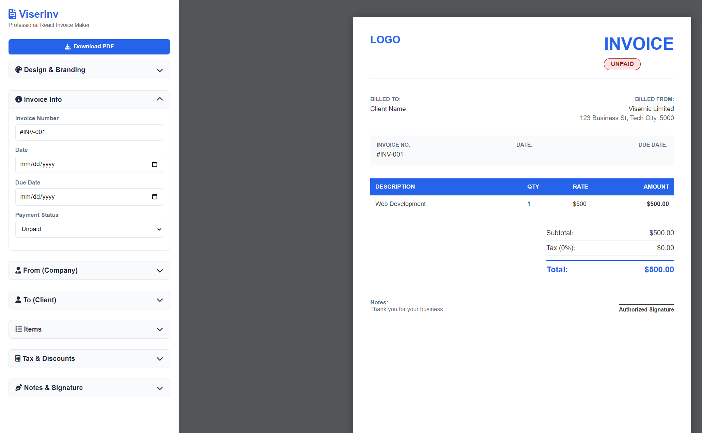

# 📄 ViserInv - Professional Invoice Generator



**ViserInv** is a modern, high-performance invoice generation tool built with **React** and **TypeScript**. It allows users to create, customize, and download professional invoices in PDF format instantly directly from the browser without requiring any backend.

## 🚀 Features

* **⚡ Real-time Preview:** See changes instantly as you type in the sidebar.
* **🎨 Custom Branding:** Upload company logos, authorized signatures, and select brand colors.
* **📄 PDF Export:** High-quality A4 PDF download functionality powered by `html2pdf.js`.
* **themes Styling:** Choose from multiple invoice styles (Clean White, Geometric Dots, Modern Abstract).
* **💰 Smart Calculations:** Automatic calculation of line items, subtotals, taxes, and grand totals.
* **🌍 Multi-Currency Support:** Support for USD, BDT, EUR, GBP, and more.
* **📱 Responsive Design:** Optimized for a smooth experience on various screen sizes.

## 🛠️ Tech Stack

* **Framework:** [React](https://reactjs.org/) (v18)
* **Language:** [TypeScript](https://www.typescriptlang.org/)
* **Build Tool:** [Vite](https://vitejs.dev/)
* **PDF Engine:** [html2pdf.js](https://ekoopmans.github.io/html2pdf.js/)
* **Icons:** FontAwesome
* **Styling:** CSS3 (Variables & Flexbox)

## 📦 Installation & Setup

Follow these steps to run the project locally on your machine.

### Prerequisites
Make sure you have [Node.js](https://nodejs.org/) installed.

### Steps

1.  **Clone the repository**
    ```bash
    git clone [https://github.com/vsn-mostafa/viserInv.git](https://github.com/vsn-mostafa/viserInv.git)
    cd viserInv
    ```

2.  **Install dependencies**
    ```bash
    npm install
    ```

3.  **Run the development server**
    ```bash
    npm run dev
    ```

4.  **Open in Browser**
    Visit `http://localhost:5173` (or the link shown in your terminal) to view the application.

## 📂 Project Structure

```text
viserInv/
├── public/              # Static assets (favicons, demo images)
│   └── viserInv-demo.png
├── src/
│   ├── App.tsx          # Main Application Logic & UI
│   ├── App.css          # Styling & Themes
│   ├── main.tsx         # Entry Point
│   └── vite-env.d.ts    # TypeScript Declarations
├── index.html           # HTML Template
├── package.json         # Dependencies & Scripts
├── tsconfig.json        # TypeScript Configuration
└── vite.config.ts       # Vite Configuration
```

## 🚀 Building for Production

To create a production-ready build:

```bash
npm run build
```
The output will be generated in the `dist` folder, which can be deployed to Vercel, Netlify, or any static hosting service.

## 🤝 Contributing

Contributions are always welcome!
1.  Fork the project
2.  Create your feature branch (`git checkout -b feature/AmazingFeature`)
3.  Commit your changes (`git commit -m 'Add some AmazingFeature'`)
4.  Push to the branch (`git push origin feature/AmazingFeature`)
5.  Open a Pull Request

## 📝 License

This project is open-source and available under the [MIT License](LICENSE).

---
*Developed by **Visernic Limited***
